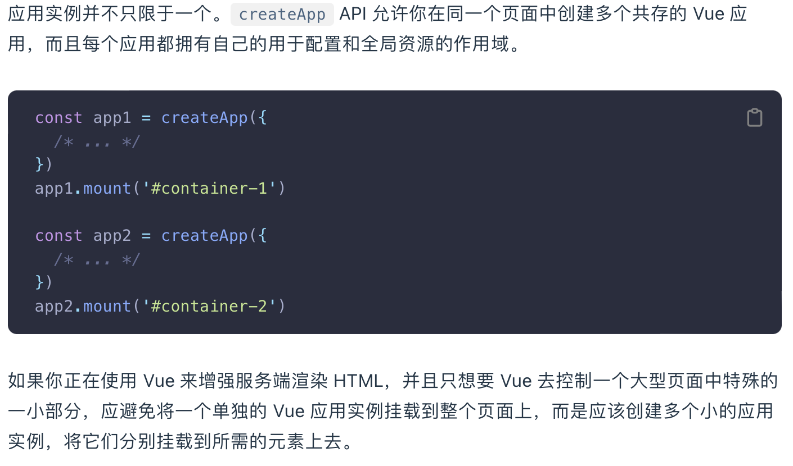

笔记内容是按我自己的情况来的，因为我之前有Web和React的基础，所以有些Vue的东西一看就会，写笔记时就比较省略或直接跳过了。

官方文档：https://cn.vuejs.org/guide/quick-start.html#try-vue-online

b站网课：https://www.bilibili.com/video/BV1Rs4y127j8?p=1

# Vue基础
主要记录了一些Vue语法  
[Vue基础](notes/Vue基础.md)

# 未解决的问题
记录了学习时没弄懂的地方，需要额外查些资料。以及还没做完的笔记

1. 多个应用实例有什么用？
2. 内置指令笔记
3. 深层响应性没理解 https://cn.vuejs.org/guide/essentials/reactivity-fundamentals.html#deep-reactivity
4. DOM更新时机没理解 https://cn.vuejs.org/guide/essentials/reactivity-fundamentals.html#dom-update-timing
5. reactive() 和 ref()的区别
6. 计算属性缓存 vs 方法，找一个实例
7. 事件修饰符，写几个实例
8. 深层侦听器，没看懂有什么区别