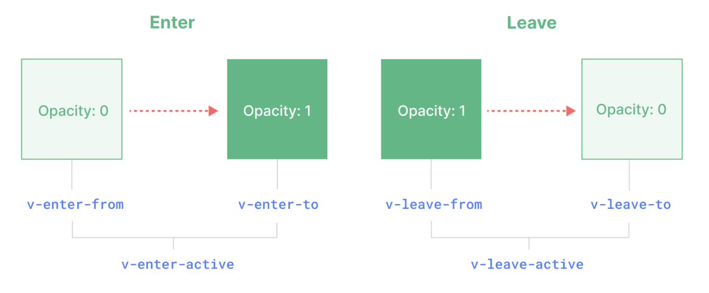
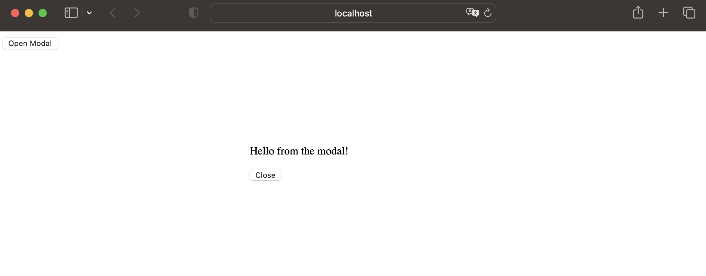

[TOC]
# Transition
> `<Transition>` 会在一个元素或组件进入和离开 DOM 时应用动画。本章节会介绍如何使用它

进入或离开可以由以下的条件之一触发
1. 由 `v-if` 所触发的切换
2. 由 `v-show` 所触发的切换
3. 由特殊元素 `<component>` 切换的动态组件
4. 改变特殊的 key 属性

> `<Transition>` 仅支持单个元素或组件作为其插槽内容。如果内容是一个组件，这个组件必须仅有一个根元素
```vue
<template>
<button @click="show = !show">Toggle</button>
<Transition>
  <p v-if="show">hello</p>
</Transition>
</template>
```

## 基于 CSS 的过渡效果
### CSS 过渡 class


1. v-enter-from：进入动画的起始状态。在元素插入之前添加，在元素插入完成后的下一帧移除。

2. v-enter-active：进入动画的生效状态。应用于整个进入动画阶段。在元素被插入之前添加，在过渡或动画完成之后移除。这个 class 可以被用来定义进入动画的持续时间、延迟与速度曲线类型。

3. v-enter-to：进入动画的结束状态。在元素插入完成后的下一帧被添加 (也就是 v-enter-from 被移除的同时)，在过渡或动画完成之后移除。

4. v-leave-from：离开动画的起始状态。在离开过渡效果被触发时立即添加，在一帧后被移除。

5. v-leave-active：离开动画的生效状态。应用于整个离开动画阶段。在离开过渡效果被触发时立即添加，在过渡或动画完成之后移除。这个 class 可以被用来定义离开动画的持续时间、延迟与速度曲线类型。

6. v-leave-to：离开动画的结束状态。在一个离开动画被触发后的下一帧被添加 (也就是 v-leave-from 被移除的同时)，在过渡或动画完成之后移除。

例
```css
/* 这一行设置了不透明度属性的过渡效果，持续时间为0.5秒，并设置了“ease”计时功能, 使过渡缓慢开始，然后加速，最后再次减速，创造更流畅的动画。 */
.v-enter-active,
.v-leave-active {
  transition: opacity 0.5s ease;
}

/* 初始离开透明度都是0 */
.v-enter-from,
.v-leave-to {
  opacity: 0;
}
```

### 为过渡效果命名
我们给一个过渡效果命名为fade
```css
.fade-enter-active,
.fade-leave-active {
  transition: opacity 0.5s ease;
}

.fade-enter-from,
.fade-leave-to {
  opacity: 0;
}
```

就可以给 <Transition> 组件传一个 `name` prop 来声明一个过渡效果名
```vue
<Transition name="fade">
  ...
</Transition>
```

### 自定义过渡 class
> 你也可以向 `<Transition>` 传递以下的 props 来指定自定义的过渡 class

enter-from-class
enter-active-class
enter-to-class
leave-from-class
leave-active-class
leave-to-class

# TransitionGroup
> `<TransitionGroup>` 是一个内置组件，用于对 v-for 列表中的元素或组件的插入、移除和顺序改变添加动画效果
## 移动动画
```vue
<TransitionGroup name="list" tag="ul">
  <li v-for="item in items" :key="item">
    {{ item }}
  </li>
</TransitionGroup>
```

```css
.list-move, /* 对移动中的元素应用的过渡 */
.list-enter-active,
.list-leave-active {
  transition: all 0.5s ease;
}

.list-enter-from,
.list-leave-to {
  opacity: 0;
  transform: translateX(30px);
}

/* 确保将离开的元素从布局流中删除
  以便能够正确地计算移动的动画。 */
.list-leave-active {
  position: absolute;
}
```

## 渐进延迟列表动画
[演练场](https://cn.vuejs.org/guide/built-ins/transition-group.html)
```vue
<TransitionGroup
  tag="ul"
  :css="false"
  @before-enter="onBeforeEnter"
  @enter="onEnter"
  @leave="onLeave"
>
  <li
    v-for="(item, index) in computedList"
    :key="item.msg"
    :data-index="index"
  >
    {{ item.msg }}
  </li>
</TransitionGroup>
```

```js
function onEnter(el, done) {
  gsap.to(el, {
    opacity: 1,
    height: '1.6em',
    delay: el.dataset.index * 0.15,
    onComplete: done
  })
}
```

# KeepAlive
> `<KeepAlive>` 是一个内置组件，它的功能是在多个组件间动态切换时缓存被移除的组件实例

[实例](https://cn.vuejs.org/guide/built-ins/keep-alive.html)

## 包含/排除
> `<KeepAlive>` 默认会缓存内部的所有组件实例，但我们可以通过 include 和 exclude prop 来定制该行为

这两个 prop 的值都可以是一个以英文逗号分隔的字符串、一个正则表达式，或是包含这两种类型的一个数组

```vue
<!-- 以英文逗号分隔的字符串 -->
<KeepAlive include="a,b">
  <component :is="view" />
</KeepAlive>

<!-- 正则表达式 (需使用 `v-bind`) -->
<KeepAlive :include="/a|b/">
  <component :is="view" />
</KeepAlive>

<!-- 数组 (需使用 `v-bind`) -->
<KeepAlive :include="['a', 'b']">
  <component :is="view" />
</KeepAlive>
```

## 最大缓存实例数
> 限制可被缓存的最大组件实例数
```vue
<KeepAlive :max="10">
  <component :is="activeComponent" />
</KeepAlive>
```

## 缓存实例的生命周期
```vue
<script setup>
import { onActivated, onDeactivated } from 'vue'

onActivated(() => {
  // 调用时机为首次挂载
  // 以及每次从缓存中被重新插入时
})

onDeactivated(() => {
  // 在从 DOM 上移除、进入缓存
  // 以及组件卸载时调用
})
</script>
```

# Teleport
> `<Teleport>` 是一个内置组件，它可以将一个组件内部的一部分模板“传送”到该组件的 DOM 结构外层的位置去

这是一个组件
```vue
<script setup>
import { ref } from 'vue'

const open = ref(false)
</script>

<template>
  <button @click="open = true">Open Modal</button>

  <div v-if="open" class="modal">
    <p>Hello from the modal!</p>
    <button @click="open = false">Close</button>
  </div>
</template>

<style scoped>
.modal {
  position: fixed;
  z-index: 999;
  top: 20%;
  left: 50%;
  width: 300px;
  margin-left: -150px;
}
</style>
```


这个组件有一些限制: 
1. `position: fixed` 能够相对于浏览器窗口放置有一个条件，那就是不能有任何祖先元素设置了 `transform`、`perspective` 或者 `filter` 样式属性。也就是说如果我们想要用 CSS transform 为祖先节点 `<div class="outer">` 设置动画，就会不小心破坏模态框的布局！
2. 这个模态框的 `z-index` 受限于它的容器元素。如果有其他元素与 `<div class="outer">` 重叠并有更高的 `z-index`，则它会覆盖住我们的模态框

`<Teleport>` 提供了一个更简单的方式来解决此类问题
```vue
<script setup>
import { ref } from 'vue'

const open = ref(false)
</script>

<template>
  <button @click="open = true">Open Modal</button>

<Teleport to="body">
  <div v-if="open" class="modal">
    <p>Hello from the modal!</p>
    <button @click="open = false">Close</button>
  </div>
</Teleport>
  
</template>

<style scoped>
.modal {
  position: fixed;
  z-index: 999;
  top: 20%;
  left: 50%;
  width: 300px;
  margin-left: -150px;
}
</style>
```
`<Teleport>` 接收一个 `to` prop 来指定传送的目标。`to` 的值可以是一个 CSS 选择器字符串，也可以是一个 DOM 元素对象。这段代码的作用就是告诉 Vue“把以下模板片段传送到 `body` 标签下”

## 禁用 Teleport

> 在某些场景下可能需要视情况禁用 `<Teleport>`。举例来说，我们想要在桌面端将一个组件当做浮层来渲染，但在移动端则当作行内组件。我们可以通过对 `<Teleport>` 动态地传入一个 disabled prop 来处理这两种不同情况

```vue
<Teleport :disabled="isMobile">
  ...
</Teleport>
```

## 多个 Teleport 共享目标
```vue
<Teleport to="#modals">
  <div>A</div>
</Teleport>
<Teleport to="#modals">
  <div>B</div>
</Teleport>
```
渲染的结果为
```vue
<div id="modals">
  <div>A</div>
  <div>B</div>
</div>
```