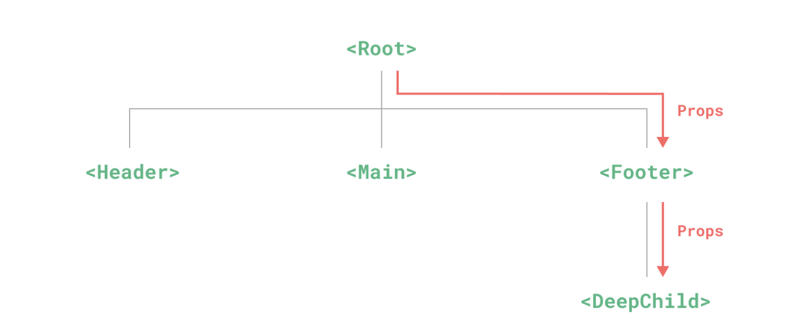
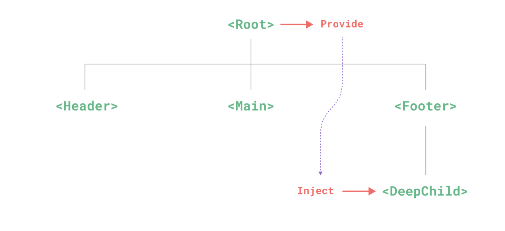

[TOC]

# 组件注册
这是一个组件 `BlogPost`
```vue
<!-- BlogPost.vue -->
<script setup>
defineProps(['title'])
defineEmits(['enlarge-text'])
</script>

<!-- BlogPost.vue, 省略了 <script> -->
<template>
<div class="blog-post">
    <h4>{{ title }}</h4>
    <button @click="$emit('enlarge-text')">Enlarge text</button>
</div>
</template>
```

## 全局注册

全局注册的组件可以在此应用的任意组件的模板中使用，使用 `app.component()` 函数来实现全局注册

```js
// main.js
import { createApp } from 'vue'
import App from './App.vue'
import BlogPostVue from './components/BlogPost.vue'

const app = createApp(App)

app.component("BlogPost", BlogPostVue)

app.mount('#app')
```

这时不需要导入 `BlogPost`，就可以使用它

```vue
<!-- App.vue -->
<script setup>
import { ref, onMounted } from 'vue'

const posts = ref([
  { id: 1, title: 'My journey with Vue' },
  { id: 2, title: 'Blogging with Vue' },
  { id: 3, title: 'Why Vue is so fun' }
])

const postFontSize = ref(1)

</script>

<template>
  <div :style="{ fontSize: postFontSize + 'em' }">
  <BlogPost
    v-for="post in posts"
    :key="post.id"
    :title="post.title"
    @enlarge-text="postFontSize += 0.1"
   />
</div>
</template>
```


app.component() 方法可以被链式调用
```js
app
  .component('ComponentA', ComponentA)
  .component('ComponentB', ComponentB)
  .component('ComponentC', ComponentC)
```


## 局部注册
局部注册的组件需要在使用它的父组件中显式导入，并且只能在该父组件中使用。它的优点是使组件之间的依赖关系更加明确

需要导入 `BlogPost`

```vue
<script setup>
import { ref, onMounted } from 'vue'
import BlogPost from "./components/BlogPost.vue"

const posts = ref([
  { id: 1, title: 'My journey with Vue' },
  { id: 2, title: 'Blogging with Vue' },
  { id: 3, title: 'Why Vue is so fun' }
])

const postFontSize = ref(1)

</script>

<template>
  <div :style="{ fontSize: postFontSize + 'em' }">
  <BlogPost
    v-for="post in posts"
    :key="post.id"
    :title="post.title"
    @enlarge-text="postFontSize += 0.1"
   />
</div>
</template>
```

# Props
## Props 声明
```vue
<script setup>
const props = defineProps(['foo'])

console.log(props.foo)

// 使用对象的形式
defineProps({
  title: String,
  likes: Number
})

</script>
```

## 传递 prop 的细节
### Prop 名字格式
如果一个 prop 的名字很长，应使用 camelCase 形式

但实际上为了和 HTML attribute 对齐，我们通常会将其写为 kebab-case 形式。Vue 提供格式转换，可以在组件里用 camelCase 格式，在调用时用kebab-case格式

`<MyComponent greeting-message="hello" />`

### 静态 vs. 动态 Prop

```vue
<BlogPost title="My journey with Vue" />
<!-- 根据一个变量的值动态传入 -->
<BlogPost :title="post.title" />

<!-- 根据一个更复杂表达式的值动态传入 -->
<BlogPost :title="post.title + ' by ' + post.author.name" />
```

### 传递不同的值类型
#### String
见上面例子

#### Number
```vue
<!-- 虽然 `42` 是个常量，我们还是需要使用 v-bind -->
<!-- 因为这是一个 JavaScript 表达式而不是一个字符串 -->
<BlogPost :likes="42" />

<!-- 根据一个变量的值动态传入 -->
<BlogPost :likes="post.likes" />
```

#### Boolean
```vue
<!-- 仅写上 prop 但不传值，会隐式转换为 `true` -->
<BlogPost is-published />

<!-- 虽然 `false` 是静态的值，我们还是需要使用 v-bind -->
<!-- 因为这是一个 JavaScript 表达式而不是一个字符串 -->
<BlogPost :is-published="false" />

<!-- 根据一个变量的值动态传入 -->
<BlogPost :is-published="post.isPublished" />
```

#### Array
```vue
<!-- 虽然这个数组是个常量，我们还是需要使用 v-bind -->
<!-- 因为这是一个 JavaScript 表达式而不是一个字符串 -->
<BlogPost :comment-ids="[234, 266, 273]" />

<!-- 根据一个变量的值动态传入 -->
<BlogPost :comment-ids="post.commentIds" />
```

#### Object
```
<!-- 虽然这个对象字面量是个常量，我们还是需要使用 v-bind -->
<!-- 因为这是一个 JavaScript 表达式而不是一个字符串 -->
<BlogPost
  :author="{
    name: 'Veronica',
    company: 'Veridian Dynamics'
  }"
 />

<!-- 根据一个变量的值动态传入 -->
<BlogPost :author="post.author" />
```

#### 使用一个对象绑定多个 prop
```vue
const post = {
  id: 1,
  title: 'My Journey with Vue'
}
<BlogPost v-bind="post" />

<!-- 等价于 -->
<BlogPost :id="post.id" :title="post.title" />
```

## 单向数据流
所有的 props 都遵循着单向绑定原则，props 因父组件的更新而变化，自然地将新的状态向下流往子组件，而不会逆向传递

想要更改一个 prop，不应该这么做
```js
const props = defineProps(['foo'])

// ❌ 警告！prop 是只读的！
props.foo = 'bar'
```

应该这样做：
1. 如果prop 被用于传入初始值；而子组件想在之后将其作为一个局部数据属性
```js
const props = defineProps(['initialCounter'])

// 计数器只是将 props.initialCounter 作为初始值
// 像下面这样做就使 prop 和后续更新无关了
const counter = ref(props.initialCounter)
```

2. 如果需要对传入的 prop 值做进一步的转换

```js
const props = defineProps(['size'])

// 该 prop 变更时计算属性也会自动更新
const normalizedSize = computed(() => props.size.trim().toLowerCase())
```

## Prop 校验
要声明对 props 的校验，你可以向 defineProps() 宏提供一个带有 props 校验选项的对象

```js
defineProps({
  // 基础类型检查
  // （给出 `null` 和 `undefined` 值则会跳过任何类型检查）
  propA: Number,
  // 多种可能的类型
  propB: [String, Number],
  // 必传，且为 String 类型
  propC: {
    type: String,
    required: true
  },
  // Number 类型的默认值
  propD: {
    type: Number,
    default: 100
  },
  // 对象类型的默认值
  propE: {
    type: Object,
    // 对象或数组的默认值
    // 必须从一个工厂函数返回。
    // 该函数接收组件所接收到的原始 prop 作为参数。
    default(rawProps) {
      return { message: 'hello' }
    }
  },
  // 自定义类型校验函数
  propF: {
    validator(value) {
      // The value must match one of these strings
      return ['success', 'warning', 'danger'].includes(value)
    }
  },
  // 函数类型的默认值
  propG: {
    type: Function,
    // 不像对象或数组的默认，这不是一个
    // 工厂函数。这会是一个用来作为默认值的函数
    default() {
      return 'Default function'
    }
  }
})
```

**补充**
1. defineProps() 宏中的参数不可以访问 `<script setup>` 中定义的其他变量
2. 校验选项中的 type 可以是下列这些原生构造函数 (String, Number, Boolean, Array, Object, Date, Function, Symbol)
3. 或自构类，Vue 会通过 instanceof Person 来校验 author prop 的值是否是 Person 类的一个实例。 例如：

```js
class Person {
  constructor(firstName, lastName) {
    this.firstName = firstName
    this.lastName = lastName
  }
}

...

defineProps({
  author: Person
})

```

## Boolean 类型转换

```js
defineProps({
  disabled: Boolean
})
```

该组件可以被这样使用

```vue
<templete>
<!-- 等同于传入 :disabled="true" -->
<MyComponent disabled />

<!-- 等同于传入 :disabled="false" -->
<MyComponent />
</templete>
```

当一个 prop 被声明为允许多种类型时，Boolean 的转换规则也将被应用。然而，当同时允许 String 和 Boolean 时，有一种边缘情况——只有当 Boolean 出现在 String 之前时，Boolean 转换规则才适用

```js
// disabled 将被转换为 true
defineProps({
  disabled: [Boolean, Number]
})
  
// disabled 将被转换为 true
defineProps({
  disabled: [Boolean, String]
})
  
// disabled 将被转换为 true
defineProps({
  disabled: [Number, Boolean]
})
  
// disabled 将被解析为空字符串 (disabled="")
defineProps({
  disabled: [String, Boolean]
})
```

# 组件事件
## 触发与监听事件
在组件的模板表达式中，可以直接使用 $emit 方法触发自定义事件

`<button @click="$emit('someEvent')">click me</button>`

父组件可以通过 v-on (缩写为 @) 来监听事件

`<MyComponent @some-event="callback" />`

## 事件参数
```vue
<templete>
<button @click="$emit('increaseBy', 1)">
  Increase by 1
</button>
</templete>
```

父组件:   
`<MyButton @increase-by="(n) => count += n" />`

或
```js
function increaseCount(n) {
  count.value += n
}

...

<MyButton @increase-by="increaseCount" />
```

## 声明触发的事件

> 组件可以显式地通过 `defineEmits()` 宏来声明它要触发的事件

```vue
<script setup>
defineEmits(['inFocus', 'submit'])
</script>
```

```vue
<script setup>
const emit = defineEmits(['inFocus', 'submit'])

function buttonClick() {
  emit('submit')
}
</script>
```

## 事件校验

```vue
<script setup>
const emit = defineEmits({
  submit(payload) {
    // 通过返回值为 `true` 还是为 `false` 来判断
    // 验证是否通过
  }
})
</script>
```

```vue
<script setup>
const emit = defineEmits({
  // 没有校验
  click: null,

  // 校验 submit 事件
  submit: ({ email, password }) => {
    if (email && password) {
      return true
    } else {
      console.warn('Invalid submit event payload!')
      return false
    }
  }
})

function submitForm(email, password) {
  emit('submit', { email, password })
}
</script>
```

# 组件 v-model
> `v-model` 可以在组件上使用以实现双向绑定

回忆一下 `v-model` 的用法

```js
<input v-model="searchText" />

// 等价于

<input
  :value="searchText"
  @input="searchText = $event.target.value"
/>
```

```js
// 使用在一个组件上
<CustomInput
  :modelValue="searchText"
  @update:modelValue="newValue => searchText = newValue"
/>

<!-- CustomInput.vue -->
// 这里不能简写，因为v-model不能作用于props
<script setup>
defineProps(['modelValue'])
defineEmits(['update:modelValue'])
</script>

<template>
  <input
    :value="modelValue"
    @input="$emit('update:modelValue', $event.target.value)"
  />
</template>
```

## v-model 的参数
> 默认情况下，`v-model` 在组件上都是使用 `modelValue` 作为 `prop，并以` `update:modelValue` 作为对应的事件

例如上面的就可以见写成
`<MyComponent v-model:title="bookTitle" />`

# 多个 v-model 绑定
```vue
<template>
<UserName
  v-model:first-name="first"
  v-model:last-name="last"
/>
</template>
```

```vue
<script setup>
defineProps({
  firstName: String,
  lastName: String
})

defineEmits(['update:firstName', 'update:lastName'])
</script>

<template>
  <input
    type="text"
    :value="firstName"
    @input="$emit('update:firstName', $event.target.value)"
  />
  <input
    type="text"
    :value="lastName"
    @input="$emit('update:lastName', $event.target.value)"
  />
</template>
```

## 处理 v-model 修饰符
[Vue基础.md](Vue基础.md#v-model-基础用法)

### 自定义 v-model修饰符

组件的 v-model 上所添加的修饰符，可以通过 modelModifiers prop 在组件内访问到。在下面的组件中，我们声明了 modelModifiers 这个 prop，它的默认值是一个空对象

注意这里组件的 modelModifiers prop 包含了 capitalize 且其值为 true，因为它在模板中的 v-model 绑定 v-model.capitalize="myText" 上被使用了

```vue
<script setup>
const props = defineProps({
  modelValue: String,
  modelModifiers: { default: () => ({}) }
})

console.log(props.modelModifiers) // { capitalize: true }

const emit = defineEmits(['update:modelValue'])

function emitValue(e) {
  let value = e.target.value
  if (props.modelModifiers.capitalize) {
    value = value.charAt(0).toUpperCase() + value.slice(1)
  }
  emit('update:modelValue', value)
}
</script>

<template>
  <input type="text" :value="modelValue" @input="emitValue" />
</template>

...

<MyComponent v-model.capitalize="myText" />
```


### 带参数的 v-model 修饰符
> 对于又有参数又有修饰符的 v-model 绑定，生成的 prop 名将是 arg + "Modifiers"。举例来说

```js
<MyComponent v-model:title.capitalize="myText">

// 相应的声明应该是

const props = defineProps(['title', 'titleModifiers'])
defineEmits(['update:title'])

console.log(props.titleModifiers) // { capitalize: true }
```

> 另一个例子，展示了如何在使用多个不同参数的 v-model 时使用修饰符

```js
<UserName
  v-model:first-name.capitalize="first"
  v-model:last-name.uppercase="last"
/>


...


<script setup>
const props = defineProps({
  firstName: String,
  lastName: String,
  firstNameModifiers: { default: () => ({}) },
  lastNameModifiers: { default: () => ({}) }
})
defineEmits(['update:firstName', 'update:lastName'])

console.log(props.firstNameModifiers) // { capitalize: true }
console.log(props.lastNameModifiers) // { uppercase: true}
</script>
```

# 组件插槽 Slots
## 插槽内容与出口
```vue
<!-- FancyButton.vue -->
<button class="fancy-btn">
  <slot></slot> <!-- 插槽出口 -->
</button>

...

<!-- App.vue -->
<FancyButton>
  Click me! <!-- 插槽内容 -->
</FancyButton>
```

## 默认内容
```vue
<button type="submit">
  <slot>
    Submit <!-- 默认内容 -->
  </slot>
</button>
```

## 具名插槽
> 有时在一个组件中包含多个插槽出口

```vue
<!-- BaseLayout.vue -->
<div class="container">
  <header>
    <!-- 标题内容放这里 -->
    <slot name="header"></slot>
  </header>
  <main>
    <!-- 主要内容放这里 -->
    <slot></slot>
  </main>
  <footer>
    <!-- 底部内容放这里 -->
    <slot name="footer"></slot>
  </footer>
</div>

...

<BaseLayout>
  <template #header>
    <h1>Here might be a page title</h1>
  </template>

  <!-- 隐式的默认插槽 -->
  <p>A paragraph for the main content.</p>
  <p>And another one.</p>

  <template #footer>
    <p>Here's some contact info</p>
  </template>
</BaseLayout>
```

## 动态插槽名
```vue
<base-layout>
  <template v-slot:[dynamicSlotName]>
    ...
  </template>

  <!-- 缩写为 -->
  <template #[dynamicSlotName]>
    ...
  </template>
</base-layout>
```

## 作用域插槽
> 同时使用父组件域内和子组件域内的数据

```vue
<!-- <MyComponent> 的模板 -->
<div>
  <slot :text="greetingMessage" :count="1"></slot>
</div>

...

<MyComponent v-slot="slotProps">
  {{ slotProps.text }} {{ slotProps.count }}
</MyComponent>
```

## 高级列表实例
```vue
<!-- FancyList.vue -->
<script setup>
import { ref } from 'vue'

const props = defineProps(['api-url', 'per-page'])

const items = ref([])

// mock remote data fetching
setTimeout(() => {
  items.value = [
    { body: 'Scoped Slots Guide', username: 'Evan You', likes: 20 },
	  { body: 'Vue Tutorial', username: 'Natalia Tepluhina', likes: 10 }
  ]
}, 1000)
</script>

<template>
  <ul>
    <li v-if="!items.length">
      Loading...
    </li>
    <li v-for="item in items">
      <slot name="item" v-bind="item"/>
    </li>
  </ul>
</template>

<style scoped>
  ul {
    list-style-type: none;
    padding: 5px;
    background: linear-gradient(315deg, #42d392 25%, #647eff);
  }
  li {
    padding: 5px 20px;
    margin: 10px;
    background: #fff;
  }
</style>
```
```vue
<!-- App.vue -->
<script setup>
import FancyList from './components/FancyList.vue'
</script>

<template>
  <FancyList :api-url="url" :per-page="10">
    <template #item="{ body, username, likes }">
      <div class="item">
        <p>{{ body }}</p>
        <p class="meta">by {{ username }} | {{ likes }} likes</p>
      </div>
    </template>
  </FancyList>
</template>

<style scoped>
.meta {
  font-size: 0.8em;
  color: #42b883;
}
</style>
```

# 依赖注入
> 通常情况下，当我们需要从父组件向子组件传递数据时，会使用 props。想象一下这样的结构：有一些多层级嵌套的组件，形成了一颗巨大的组件树，而某个深层的子组件需要一个较远的祖先组件中的部分数据。在这种情况下，如果仅使用 props 则必须将其沿着组件链逐级传递下去，这会非常麻烦。provide 和 inject 可以帮助我们解决这一问题。




## Provide
> 要为组件后代提供数据，需要使用到 provide() 函数
```vue
<script setup>
import { provide } from 'vue'

provide(/* 注入名 */ 'message', /* 值 */ 'hello!')
</script>
```

```vue
<script>
import { ref, provide } from 'vue'

const count = ref(0)
provide('key', count)
</script>
```

### 应用层 Provide
```js
import { createApp } from 'vue'

const app = createApp({})

app.provide(/* 注入名 */ 'message', /* 值 */ 'hello!')
```

## Inject (注入)
> 要注入上层组件提供的数据，需使用 inject() 函数

```vue
<script setup>
import { inject } from 'vue'

const message = inject('message')
</script>
```
### 注入默认值
> 如果在注入一个值时不要求必须有提供者，那么我们应该声明一个默认值，和 props 类似

```js
// 如果没有祖先组件提供 "message"
// `value` 会是 "这是默认值"
const value = inject('message', '这是默认值')
```

> 在一些场景中，默认值可能需要通过调用一个函数或初始化一个类来取得。为了避免在用不到默认值的情况下进行不必要的计算或产生副作用，我们可以使用工厂函数来创建默认值

```js
const value = inject('key', () => new ExpensiveClass(), true)
```

## 和响应式数据配合使用
```vue
<!-- 在供给方组件内 -->
<script setup>
import { provide, ref } from 'vue'

const location = ref('North Pole')

function updateLocation() {
  location.value = 'South Pole'
}

provide('location', {
  location,
  updateLocation
})
</script>

<!-- 在注入方组件 -->
<script setup>
import { inject } from 'vue'

const { location, updateLocation } = inject('location')
</script>

<template>
  <button @click="updateLocation">{{ location }}</button>
</template>
```

## 只读性注入
> 如果你想确保提供的数据不能被注入方的组件更改，你可以使用 readonly() 来包装提供的值

```vue
<script setup>
import { ref, provide, readonly } from 'vue'

const count = ref(0)
provide('read-only-count', readonly(count))
</script>
```

## 使用 Symbol 作注入名
> 如果你正在构建大型的应用，包含非常多的依赖提供，或者你正在编写提供给其他开发者使用的组件库，建议最好使用 Symbol 来作为注入名以避免潜在的冲突

```js
// keys.js
export const myInjectionKey = Symbol()

// 在供给方组件中
import { provide } from 'vue'
import { myInjectionKey } from './keys.js'

provide(myInjectionKey, { /*
  要提供的数据
*/ });

// 注入方组件
import { inject } from 'vue'
import { myInjectionKey } from './keys.js'

const injected = inject(myInjectionKey)
```

# 异步组件
## defineAsyncComponent
1. `defineAsyncComponent` 方法接收一个返回 Promise 的加载函数
2. 这个 Promise 的 resolve 回调方法应该在从服务器获得组件定义时调用
   1. 你也可以调用 reject(reason) 表明加载失败
3. 最后得到的 AsyncComp 是一个外层包装过的组件，仅在页面需要它渲染时才会调用加载内部实际组件的函数


```vue
<script>
import { defineAsyncComponent } from 'vue'

const AsyncComp = defineAsyncComponent(() => {
  return new Promise((resolve, reject) => {
    // ...从服务器获取组件
    resolve(/* 获取到的组件 */)
  })
})
// ... 像使用其他一般组件一样使用 `AsyncComp`
</script>
```

```vue

<script>
import { defineAsyncComponent } from 'vue'

const AsyncComp = defineAsyncComponent(() =>
  import('./components/MyComponent.vue')
)
</script>
```