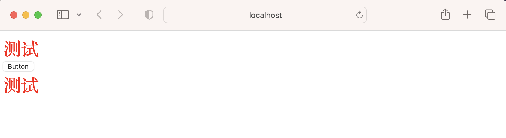
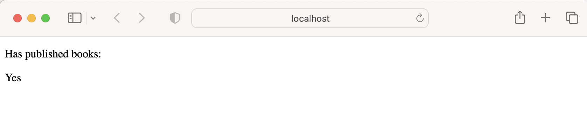

[TOC]
# Vue基础
## 创建Vue应用
1. 安装 16.0 或更高版本的 Node.js。下载地址：https://nodejs.org/en

2. 命令行运行`npm init vue@latest`


## 模版语法

### 文本插值
> 最基本的数据绑定形式是文本插值，它使用的是“Mustache”语法 (即双大括号)
```vue
<span>Message: {{ msg }}</span>
```
**App.vue**
```vue
<script>
export default{
  data(){
    return{
      msg: "文本插值的文字"
    }
  }
}
</script>

<template>
  <h3>文本插值: {{ msg }}</h3>
</template>

```


### 使用Javascript表达式
```vue
<script>
export default{
  data(){
    return{
      number: 10,
      ok: true,
      message: "Hellow World"
    }
  }
}
</script>

<template>
  <p>{{ number + 1 }}</p>
  <p>{{ ok ? "Yes" : "No" }}</p>
  <p>{{ message.split().reverse().join("") }}</p>
</template>
```


### 原始Html
> 若想插入 HTML，你需要使用 v-html 指令:  

**App.vue**
```vue
<script>
export default{
  data(){
    return{
      rawHtml: '<span style="color: red">This should be red.</span>'
    }
  }
}
</script>

<template>
  <p>Using text interpolation: {{ rawHtml }}</p>
  <p>Using v-html directive: <span v-html="rawHtml"></span></p>
</template>
```


**注意:** 在网站上动态渲染任意 HTML 是非常危险的，因为这非常容易造成 XSS 漏洞。请仅在内容安全可信时再使用 v-html，并且永远不要使用用户提供的 HTML 内容。

### Attribute 绑定
> 双大括号不能在 HTML attributes 中使用。想要响应式地绑定一个 attribute，应该使用 v-bind 指令：


`<div :id="dynamicId"></div>`  
或简写  
`<div :id="dynamicId"></div>`

```vue
<template>
<div :id="dynamicId" :class="dynamicClass" v-bind:title="dynamicTitle">测试</div>
<button :disabled="isButtonDisabled">Button</button>
<div v-bind="objectOfAttributes">测试</div>
</template>
<script>
export default{
  data(){
    return{
      dynamicClass: "appClass",
      dynamicId: "appId",
      dynamicTitle: undefined,
      isButtonDisabled: false,
      objectOfAttributes: {
        class: "appClass",
        id: "appId",
      }
    }
  }
}
</script>
<style>
.appClass{
  color: red;
  font-size: 30px;
}
</style>
```


### 指令Direction
指令是带有 v- 前缀的特殊 attribute。Vue 提供了许多[内置指令](https://cn.vuejs.org/api/built-in-directives.html)，包括上面我们所介绍的 v-bind 和 v-html。
> 一个指令的任务是在其表达式的值变化时响应式地更新 DOM。

E.g. `<p v-if="seen">Now you see me</p>`

**完整的指令语法**


#### 参数
> 某些指令会需要一个“参数”，在指令名后通过一个冒号隔开做标识。例如上面提到的v-bind。
```vue
<a v-bind:href="url"> ... </a>

<!-- 简写 -->
<a :href="url"> ... </a>

------

<a v-on:click="doSomething"> ... </a>

<!-- 简写 -->
<a @click="doSomething"> ... </a>
```

#### 动态参数
```vue
<a v-bind:[attributeName]="url"> ... </a>

<!-- 简写 -->
<a :[attributeName]="url"> ... </a>
```
**动态参数值的限制:** 动态参数中表达式的值应当是一个字符串，或者是 null

#### 修饰符 Modifiers
>修饰符是以点开头的特殊后缀，表明指令需要以一些特殊的方式被绑定。

例如 .prevent 修饰符会告知 v-on 指令对触发的事件调用 event.preventDefault()：  
`<form @submit.prevent="onSubmit">...</form>`

## 响应式基础
### `ref()`
> 在组合式 API 中，推荐使用 ref() 函数来声明响应式状态


> ref() 接收参数，并将其包裹在一个带有 .value 属性的 ref 对象中返回


> 在template中使用 ref 时，我们不需要附加 .value

```vue
<template>
  <button @click="count++">Click 1</button>
<button @click=increment>Click 2</button>
<div>{{ count }}</div>
</template>
<script>
import { ref } from 'vue'

export default {
  // `setup` 是一个特殊的钩子，专门用于组合式 API。
  setup() {
    const count = ref(0)

    function increment() {
      // 在 JavaScript 中需要 .value
      count.value++
    }

    // 将 ref 暴露给模板
    return {
      count,
      increment
    }
  }
}
</script>
```


### `<script setup></script>`
上面代码的简写
```vue
<script setup>
import { ref } from 'vue'

const count = ref(0)

function increment() {
  count.value++
}
</script>

<template>
  <button @click="increment">
    {{ count }}
  </button>
</template>
```

### `reactive()`
```vue
<template>
  <button @click="state.count++">Click 1</button>
<button @click=increment>Click 2</button>
<div>{{ state.count }}</div>
</template>

<script setup>
import { reactive } from 'vue'

const state = reactive({ count: 0 })

function increment() {
  state.count++
}
</script>
```

## 计算属性
### 基础示例
>推荐使用计算属性来描述依赖响应式状态的复杂逻辑

我们在这里定义了一个计算属性 `publishedBooksMessage`。`computed()` 方法期望接收一个 getter 函数，返回值为一个计算属性 `ref`。和其他一般的 `ref` 类似，你可以通过 `publishedBooksMessage.value` 访问计算结果。计算属性 `ref` 也会在模板中自动解包，因此在模板表达式中引用时无需添加 `.value`。

Vue 的计算属性会自动追踪响应式依赖。它会检测到 `publishedBooksMessage` 依赖于 `author.books`，所以当 `author.books` 改变时，任何依赖于 `publishedBooksMessage` 的绑定都会同时更新。

```vue
<script setup>
import { reactive, computed } from 'vue'

const author = reactive({
  name: 'John Doe',
  books: [
    'Vue 2 - Advanced Guide',
    'Vue 3 - Basic Guide',
    'Vue 4 - The Mystery'
  ]
})

// 一个计算属性 ref
const publishedBooksMessage = computed(() => {
  return author.books.length > 0 ? 'Yes' : 'No'
})
</script>

<template>
  <p>Has published books:</p>
  <span>{{ publishedBooksMessage }}</span>
</template>
```


### 计算属性缓存 vs 方法
在上面的示例中，我们在表达式中像这样调用一个函数也会获得和计算属性相同的结果。
```vue
<p>{{ calculateBooksMessage() }}</p>
...
// 组件中
function calculateBooksMessage() {
  return author.books.length > 0 ? 'Yes' : 'No'
}
```
>计算属性值会基于其响应式依赖被缓存, 一个计算属性仅会在其响应式依赖更新时才重新计算, 相比之下，方法调用总是会在重渲染发生时再次执行函数。

这也解释了为什么下面的计算属性永远不会更新，因为 Date.now() 并不是一个响应式依赖
`const now = computed(() => Date.now())`

### 可写计算属性
> 计算属性默认是只读的。当你尝试修改一个计算属性时，你会收到一个运行时警告。只在某些特殊场景中你可能才需要用到“可写”的属性，你可以通过同时提供 getter 和 setter 来创建

```vue
<script setup>
import { ref, computed } from 'vue'

const firstName = ref('John')
const lastName = ref('Doe')

const fullName = computed({
  // getter
  get() {
    return firstName.value + ' ' + lastName.value
  },
  // setter
  set(newValue) {
    // 注意：我们这里使用的是解构赋值语法
    [firstName.value, lastName.value] = newValue.split(' ')
  }
})
</script>
```

## Class 与 Style 绑定
### 绑定 HTML class
#### 绑定对象
```vue
<script setup>
import { ref } from 'vue'

const isActive = ref(true)
const hasError = ref(false)

</script>

<template>
  <div
  class="static"
  :class="{ active: isActive, 'text-danger': hasError }"
>test</div>
</template>

<style>
.static{
  color: red;
}
</style>
```

> 绑定的对象并不一定需要写成内联字面量的形式，也可以直接绑定一个对象

```vue
const classObject = reactive({
  active: true,
  'text-danger': false
})

...

<div :class="classObject"></div>
```

#### 绑定数组

```vue
const activeClass = ref('active')
const errorClass = ref('text-danger')

...

<div :class="[activeClass, errorClass]"></div>
```

在数组中有条件地渲染某个 class
```vue
<!-- 三元表达式 -->
<div :class="[isActive ? activeClass : '', errorClass]"></div>

<!-- 数组中嵌套对象 -->
<div :class="[{ active: isActive }, errorClass]"></div>
```

#### 在组件上使用

### 绑定内联样式
#### 绑定对象
1. `:style` 支持绑定 JavaScript 对象值，对应的是 HTML 元素的 style 属性
2. 同时支持 camelCase 和 kebab-cased 形式
3. 也可以直接绑定一个样式对象
4. 也可以绑定一个数组（同:class）
5. 自动前缀 --- 如果浏览器不支持某个属性，那么将尝试加上各个浏览器特殊前缀，以找到哪一个是被支持的。
6. 可以对一个样式属性提供多个 (不同前缀的) 值, 数组仅会渲染浏览器支持的最后一个值
```vue
const activeColor = ref('red')
const fontSize = ref(30)

<!-- camelCase -->
<div :style="{ color: activeColor, fontSize: fontSize + 'px' }"></div>

<!-- kebab-cased -->
<div :style="{ 'font-size': fontSize + 'px' }"></div>

<!-- 直接绑定一个样式对象 -->
const styleObject = reactive({
  color: 'red',
  fontSize: '13px'
})
<div :style="styleObject"></div>

<!-- 绑定数组 -->
<div :style="[baseStyles, overridingStyles]"></div>

<!-- 样式多值 -->
<div :style="{ display: ['-webkit-box', '-ms-flexbox', 'flex'] }"></div>
```

## 条件渲染
### v-if, v-else, v-else-if
```vue
<script setup>
import { ref } from 'vue'

const ifShow = ref(true)
const count = ref(1)

</script>

<template>
  <button @click="ifShow = !ifShow">Change ifShow</button>
  <button @click="count++">change count</button>
  <p v-if="count == 1">count = 1</p>
  <p v-else-if="count == 2">count = 2</p>
  <p v-else="count == 3">count = 3</p>
  <template v-if="ifShow">
    <p>ifShow is True</p>
    <p>ifShow is True</p>
  </template>
</template>
```

### v-show
> v-show 仅切换了该元素上名为 display 的 CSS 属性。会在 DOM 渲染中保留该元素
`<h1 v-show="ok">Hello!</h1>`

### `v-if` vs. `v-show`
> 如果需要频繁切换，则使用 v-show 较好；如果在运行时绑定条件很少改变，则 v-if 会更合适。

详情请看: [链接](https://cn.vuejs.org/guide/essentials/conditional.html#v-if-vs-v-show)

## 列表渲染
### `v-for`
```vue
<script setup>
import { ref } from 'vue'
const parentMessage = ref('Parent')
const items = ref([{ message: 'Foo' }, { message: 'Bar' }])
</script>

<template>
  <!-- item 是迭代项的别名 -->
  <li v-for="item in items">
    {{ item.message }}
  </li>

  <!-- 使用 of 作为分隔符来替代 in -->
  <li v-for="item in items">
    {{ item.message }}
  </li>

  <!-- index 表示当前项的位置索引 -->
  <li v-for="(item, index) in items">
    {{ parentMessage }} - {{ index }} - {{ item.message }}
  </li>

  <!-- 通过 key 管理状态 -->
  <div v-for="item in items" :key="item.id">
  <!-- 内容 -->
  </div>

  <!-- 定义 v-for 的变量别名时使用解构 -->
  <li v-for="{ message } in items">
    {{ message }}
  </li>

  <!-- 有 index 索引时 -->
  <li v-for="({ message }, index) in items">
    {{ message }} {{ index }}
  </li>

  <!-- 多层嵌套的 v-for -->
  <li v-for="item in items">
    <span v-for="childItem in item.children">
      {{ item.message }} {{ childItem }}
    </span>
  </li>

  <!-- 在 v-for 里使用范围值 -->
  <span v-for="n in 10">{{ n }}</span>

  <!-- <template> 上的 v-for -->
  <ul>
    <template v-for="item in items">
        <li>{{ item.msg }}</li>
        <li class="divider" role="presentation"></li>
    </template>
    </ul>

    <!-- v-for 与对象 -->
    <!-- 遍历的顺序会基于对该对象调用 Object.keys() 的返回值来决定 -->
    <ul>
        <li v-for="value in myObject">
        {{ value }}
        </li>
    </ul>

    <!-- 可以通过提供第二个参数表示属性名  -->
    <ul>
        <li v-for="(value, key) in myObject">
        {{ key }}: {{ value }}
        </li>
    </ul>

    <!-- 第三个参数表示位置索引 -->
    <ul>
        <li v-for="(value, key, index) in myObject">
        {{ index }}. {{ key }}: {{ value }}
        </li>
    </ul>
</template>
```

### 在组件上使用 `v-for`
`v-for` 不会自动将任何数据传递给组件, 为了将迭代后的数据传递到组件中，我们还需要传递 props

`<MyComponent v-for="item in items" :key="item.id" />`

`<MyComponent
  v-for="(item, index) in items"
  :item="item"
  :index="index"
  :key="item.id"/>`

### 数组变化侦测
> 数组在被调用下面这些方法时会触发相关的更新

1. `push()`
2. `pop()`
3. `shift()`
4. `unshift()`
5. `splice()`
6. `sort()`
7. `reverse()`
8. `filter()`
9. `concat()`
10. `slice()`

> 在计算属性中使用 reverse() 和 sort() 的时候务必小心！这两个方法将变更原始数组，计算函数中不应该这么做。请在调用这些方法之前创建一个原数组的副本

```vue
- return numbers.reverse()
+ return [...numbers].reverse()
```

## 事件处理
### v-on
`v-on:click="handler"`
简写: `@click="handler"`

```vue
<script setup>
import { ref } from 'vue'

const count = ref(0)
const name = ref('Vue.js')

function greet(event) {
  alert(`Hello ${name.value}!`)
  // `event` 是 DOM 原生事件
  if (event) {
    alert(event.target.tagName)
  }
}

function say(message) {
  alert(message)
}

function warn(message, event) {
  // 这里可以访问原生事件
  if (event) {
    event.preventDefault()
  }
  alert(message)
}
</script>

<template>
  <!-- 内联事件处理器 -->
  <button @click="count++">Add 1</button>
  <p>Count is: {{ count }}</p>  

  <!-- 方法事件处理器 -->
  <button @click="greet">Greet</button>
  <button @click="say('hello')">Say hello</button>

  <!-- 使用特殊的 $event 变量 -->
  <button @click="warn('Form cannot be submitted yet.', $event)">
    Submit
  </button>

  <!-- 另一种写法，使用内联箭头函数 -->
  <button @click="(event) => warn('Form cannot be submitted yet.', event)">
    Submit
  </button>
</template>
```

### 修饰符

> 在处理事件时调用 event.preventDefault() 等函数是很常见的。为了简便, v-on 提供了修饰符。修饰符是用 . 表示的指令后缀，包含以下这些：
#### 事件修饰符
1. `.stop`
2. `.prevent`
3. `.self`
4. `.capture`
5. `.once`
6. `.passive`
7. `.capture`
8. `.once`
9. `.passive`
10. 

```vue
<!-- 单击事件将停止传递 -->
<a @click.stop="doThis"></a>

<!-- 提交事件将不再重新加载页面 -->
<form @submit.prevent="onSubmit"></form>

<!-- 修饰语可以使用链式书写 -->
<a @click.stop.prevent="doThat"></a>

<!-- 也可以只有修饰符 -->
<form @submit.prevent></form>

<!-- 仅当 event.target 是元素本身时才会触发事件处理器 -->
<!-- 例如：事件处理器不来自子元素 -->
<div @click.self="doThat">...</div>
```

#### 按键修饰符
1. `.enter`
2. `.tab`
3. `.delete (捕获“Delete”和“Backspace”两个按键)`
4. `.esc`
5. `.space`
6. `.up`
7. `.down`
8. `.left`
9. `.right`
10. `.ctrl`
11. `.alt`
12. `.shift`
13. `.meta`
14. ...


```vue
<!-- 仅在 `key` 为 `Enter` 时调用 `submit` -->
<input @keyup.enter="submit" />

<!-- Alt + Enter -->
<input @keyup.alt.enter="clear" />

<!-- Ctrl + 点击 -->
<div @click.ctrl="doSomething">Do something</div>
```

#### `.exact`修饰符
> .exact 修饰符允许控制触发一个事件所需的确定组合的系统按键修饰符

```vue
<!-- 当按下 Ctrl 时，即使同时按下 Alt 或 Shift 也会触发 -->
<button @click.ctrl="onClick">A</button>

<!-- 仅当按下 Ctrl 且未按任何其他键时才会触发 -->
<button @click.ctrl.exact="onCtrlClick">A</button>

<!-- 仅当没有按下任何系统按键时触发 -->
<button @click.exact="onClick">A</button>
```

#### 鼠标按键修饰符
1. `.left`
2. `.middle`
3. `.right`

## 表单输入绑定
### `v-model` 基础用法

```vue
<script setup>
import { ref } from 'vue'

const message = ref("")
const checked = ref(false)

const checkedNames = ref([])

const picked = ref("One")

const selected = ref("A")

const options = ref([
  { text: 'One', value: 'A' },
  { text: 'Two', value: 'B' },
  { text: 'Three', value: 'C' }
])

</script>

<template>
  <!-- 文本 -->
  <p>Message is: {{ message }}</p>
  <input v-model="message" placeholder="edit me" />

  <!-- 多行文本 textarea -->
  <span>Multiline message is:</span>
  <p style="white-space: pre-line;">{{ message }}</p>
  <textarea v-model="message" placeholder="add multiple lines"></textarea>

  <!-- 复选框 checkbox -->
  <div>复选框 checkbox</div>
  <input type="checkbox" id="checkbox" v-model="checked" />
  <label for="checkbox">{{ checked }}</label>

  <!-- 多个复选框绑定到同一个数组 -->
  <div>Checked names: {{ checkedNames }}</div>

  <input type="checkbox" id="jack" value="Jack" v-model="checkedNames">
  <label for="jack">Jack</label>

  <input type="checkbox" id="john" value="John" v-model="checkedNames">
  <label for="john">John</label>

  <input type="checkbox" id="mike" value="Mike" v-model="checkedNames">
  <label for="mike">Mike</label>

  <!-- 单选按钮 -->
  <div>Picked: {{ picked }}</div>

  <input type="radio" id="one" value="One" v-model="picked" />
  <label for="one">One</label>

  <input type="radio" id="two" value="Two" v-model="picked" />
  <label for="two">Two</label>

  <!-- 选择器 -->
  <div>Selected: {{ selected }}</div>

  <select v-model="selected">
    <option disabled value="">Please select one</option>
    <option>A</option>
    <option>B</option>
    <option>C</option>
  </select>

  <!-- 多选 (值绑定到一个数组) -->
  <div>Selected: {{ selected }}</div>

  <select v-model="selected" multiple>
    <option>A</option>
    <option>B</option>
    <option>C</option>
  </select>

  <!-- v-for 与选择器结合 -->
  <div>v-for 与选择器结合</div>
  <select v-model="selected">
    <option v-for="option in options" :key="option.value" :value="option.value">
      {{ option.text }}
    </option>
  </select>

  <div>Selected: {{ selected }}</div>

</template>
```

### 值绑定
#### 复选框
通过 `true-value` 和 `false-value` 来绑定选择和未选择的值。选择后 `toggle` 会被赋值 `yes`
```vue
<template>
  <div>{{ "toggle: " + toggle }}</div>
  <input
    type="checkbox"
    v-model="toggle"
    true-value="yes"
    false-value="no" />
</template>
```

#### 单选按钮
同上
```vue
<template>
  <input type="radio" v-model="pick" :value="first" />
  <input type="radio" v-model="pick" :value="second" />
</template>
```

#### 选择器选项
```vue
<template>
  <div>{{ "selected: " + selected.number }}</div>
  <select v-model="selected">
    <!-- 内联对象字面量 -->
    <option :value="{ number: 123 }">123</option>
  </select>
</template>
```

### 修饰符
#### `.lazy`
> 默认情况下，v-model 会在每次 input 事件后更新数据。可以添加 `.lazy` 修饰符来改为在每次 change 事件后更新数据：

```vue
<template>
  <div>
    <input v-model.lazy="message" type="text" placeholder="Enter your message">
    <p>Message: {{ message }}</p>
  </div>
</template>

<script setup>
  import { ref } from 'vue';

  const message = ref("")
</script>
```

#### `.number`
> 让用户输入自动转换为数字。如果该值无法被 parseFloat() 处理，那么将返回原始值

`<input v-model.number="age" />`

#### `.trim`
> 默认自动去除用户输入内容中两端的空格

`<input v-model.trim="msg" />`

## 生命周期
```vue
<!-- 用例 -->
<script setup>
import { onMounted } from 'vue'

onMounted(() => {
  console.log(`the component is now mounted.`)
})
</script>
```


## 侦听器
### `watch()`
> 在组合式 API 中，我们可以使用 watch 函数在每次响应式状态发生变化时触发回调函数
```vue
<script setup>
import { ref, watch } from 'vue'

const question = ref('')
const answer = ref('Questions usually contain a question mark. ;-)')

// 可以直接侦听一个 ref
watch(question, async (newQuestion, oldQuestion) => {
  if (newQuestion.indexOf('?') > -1) {
    answer.value = 'Thinking...'
    try {
      const res = await fetch('https://yesno.wtf/api')
      answer.value = (await res.json()).answer
    } catch (error) {
      answer.value = 'Error! Could not reach the API. ' + error
    }
  }
})
</script>

<template>
  <p>
    Ask a yes/no question:
    <input v-model="question" />
  </p>
  <p>{{ answer }}</p>
</template>
```

### 侦听数据源类型
```vue
<script setup>
import { ref, watch } from 'vue'

const x = ref(0)
const y = ref(0)
const z = ref(0)

// 单个 ref，只有x更新时才会调用
watch(x, (newX) => {
  console.log(`x is ${newX}`)
})

// getter 函数，监听 x+y, 不管其中哪个改变，都会调用这个，参数是 x+y
watch(
  () => x.value + y.value,
  (sum) => {
    console.log(`sum of x + y is: ${sum}`)
  }
)

// 多个来源组成的数组，监听 x 和 y，参数是 x 和 y
// () => y.value 可以写成 y
watch([x, () => y.value], ([newX, newY]) => {
  console.log(`x is ${newX} and y is ${newY}`)
})
</script>

<template>
  <p>
    x
    <input v-model="x" />
  </p>
  <p>
    y
    <input v-model="y" />
  </p>
  <p>
    z
    <input v-model="z" />
  </p>
</template>
```

### 侦听对象类型
```vue
<script setup>
import { ref, watch, reactive } from 'vue'

const x = ref(0)
const y = ref(0)
const z = ref(0)

// 单个 ref，只有x更新时才会调用
watch(x, (newX) => {
  console.log(`x is ${newX}`)
})

// getter 函数，监听 x+y, 不管其中哪个改变，都会调用这个，参数是 x+y
watch(
  () => x.value + y.value,
  (sum) => {
    console.log(`sum of x + y is: ${sum}`)
  }
)

// 多个来源组成的数组，监听 x 和 y，参数是 x 和 y
// () => y.value 可以写成 y
watch([x, () => y.value], ([newX, newY]) => {
  console.log(`x is ${newX} and y is ${newY}`)
})

const obj = reactive({ count: 0 })

// 这里只能写 () => obj.count，不能直接写 obj.count
watch(() => obj.count, (count) => {
  console.log(`count is: ${count}`)
})
</script>

<template>
  <p>
    x
    <input v-model="x" />
  </p>
  <p>
    y
    <input v-model="y" />
  </p>
  <p>
    z
    <input v-model="z" />
  </p>
  <p>
    obj.count
    <input v-model="obj.count" />
  </p>
</template>
```

### 深层侦听器

### 即时回调的侦听器
> watch 仅当数据源变化时，才会执行回调。但在某些场景中，我们希望在创建侦听器时，立即执行一遍回调。我们可以通过传入 immediate: true 选项来强制侦听器的回调立即执行

```vue
<script>
watch(source, (newValue, oldValue) => {
  // 立即执行，且当 `source` 改变时再次执行
}, { immediate: true })
</script>
```

### watchEffect()
```vue
<script>
const todoId = ref(1)
const data = ref(null)

watch(todoId, async () => {
  const response = await fetch(
    `https://jsonplaceholder.typicode.com/todos/${todoId.value}`
  )
  data.value = await response.json()
}, { immediate: true })
</script>
```

可简写成
```vue
<script>
const todoId = ref(1)
const data = ref(null)

watchEffect(async () => {
  const response = await fetch(
    `https://jsonplaceholder.typicode.com/todos/${todoId.value}`
  )
  data.value = await response.json()
})
</script>
```
注意此时 `watchEffect` 只用到了 `todoId`，所以只有 `todoId` 被改变时才会调用。如果有其他的变量，那么任意一个改变时都会调用。


### 回调的触发时机
> 默认情况下，用户创建的侦听器回调，都会在 Vue 组件更新之前被调用。这意味着你在侦听器回调中访问的 DOM 将是被 Vue 更新之前的状态

解决方案：  
1. `flush: 'post'`
```vue
<script>
watch(source, callback, {
  flush: 'post'
})

watchEffect(callback, {
  flush: 'post'
})
</script>
```

2. 后置刷新的 `watchEffect()` 有个更方便的别名 `watchPostEffect()`

```vue
<script>
import { watchPostEffect } from 'vue'

watchPostEffect(() => {
  /* 在 Vue 更新后执行 */
})
</script>
```

### 停止侦听器
> 在 `setup()` 或 `<script setup>` 中用同步语句创建的侦听器，会自动绑定到宿主组件实例上，并且会在宿主组件卸载时自动停止

> 如果用异步回调创建一个侦听器，那么它不会绑定到当前组件上，你必须手动停止它

例：
```vue
<script setup>
import { watchEffect } from 'vue'

// 它会自动停止
watchEffect(() => {})

// ...这个则不会！
setTimeout(() => {
  watchEffect(() => {})
}, 100)
</script>
```

**手动停止一个侦听器**
```vue
<script>
const unwatch = watchEffect(() => {})

// ...当该侦听器不再需要时
unwatch()
</script>
```

> 注意，需要异步创建侦听器的情况很少，请尽可能选择同步创建。如果需要等待一些异步数据，你可以使用条件式的侦听逻辑

```vue
<script>
// 需要异步请求得到的数据
const data = ref(null)

watchEffect(() => {
  if (data.value) {
    // 数据加载后执行某些操作...
  }
})
</script>
```

## 模板引用
### 访问模板引用
```vue
<script setup>
import { ref, onMounted } from 'vue'

// 声明一个 ref 来存放该元素的引用
// 必须和模板里的 ref 同名
const input = ref(null)

onMounted(() => {
  input.value.focus()
})
</script>

<template>
  <input ref="input" />
</template>
```
如果你需要侦听一个模板引用 ref 的变化，确保考虑到其值为 null 的情况
```vue
<script>
watchEffect(() => {
  if (input.value) {
    input.value.focus()
  } else {
    // 此时还未挂载，或此元素已经被卸载（例如通过 v-if 控制）
  }
})
</script>
```

### v-for 中的模板引用
> 当在 v-for 中使用模板引用时，对应的 ref 中包含的值是一个数组，它将在元素被挂载后包含对应整个列表的所有元素：

```vue
<script setup>
import { ref, onMounted } from 'vue'

const list = ref([
  /* ... */
])

const itemRefs = ref([])

onMounted(() => console.log(itemRefs.value))
</script>

<template>
  <ul>
    <li v-for="item in list" ref="itemRefs">
      {{ item }}
    </li>
  </ul>
</template>
```

### 函数模板引用
> 除了使用字符串值作名字，ref attribute 还可以绑定为一个函数，会在每次组件更新时都被调用。该函数会收到元素引用作为其第一个参数

`<input :ref="(el) => { /* 将 el 赋值给一个数据属性或 ref 变量 */ }">`

1. 注意我们这里需要使用动态的 :ref 绑定才能够传入一个函数。
2. 当绑定的元素被卸载时，函数也会被调用一次，此时的 el 参数会是 null。
3. 你当然也可以绑定一个组件方法而不是内联函数。

## 组件基础
### 定义一个组件
> 当使用构建步骤时，我们一般会将 Vue 组件定义在一个单独的 .vue 文件中，这被叫做**单文件组件**
```vue
<script setup>
import { ref } from 'vue'

const count = ref(0)
</script>

<template>
  <button @click="count++">You clicked me {{ count }} times.</button>
</template>
```

> 当不使用构建步骤时，一个 Vue 组件以一个包含 Vue 特定选项的 JavaScript 对象来定义，并在一个 .js 文件里默认导出了它自己

```js
import { ref } from 'vue'

export default {
  setup() {
    const count = ref(0)
    return { count }
  },
  template: `
    <button @click="count++">
      You clicked me {{ count }} times.
    </button>`
  // 也可以针对一个 DOM 内联模板：
  // template: '#my-template-element'
}
```

### 使用组件
```vue
<script setup>
import ButtonCounter from './ButtonCounter.vue'
</script>

<template>
  <h1>Here is a child component!</h1>
  <ButtonCounter />
</template>
```

### 传递 props
```vue
<!-- BlogPost.vue -->
<script setup>
defineProps(['title'])
</script>

<template>
  <h4>{{ title }}</h4>
</template>

<!-- another .vue -->
<script>
<BlogPost title="My journey with Vue" />
<BlogPost title="Blogging with Vue" />
<BlogPost title="Why Vue is so fun" />
</script>

<!-- another .vue -->
<script>
const posts = ref([
  { id: 1, title: 'My journey with Vue' },
  { id: 2, title: 'Blogging with Vue' },
  { id: 3, title: 'Why Vue is so fun' }
])

<BlogPost
  v-for="post in posts"
  :key="post.id"
  :title="post.title"
 />
</script>
```

> defineProps 会返回一个对象，其中包含了可以传递给组件的所有 props：
```vue
<script>
const props = defineProps(['title'])
console.log(props.title)
</script>
```

> 如果你没有使用 `<script setup>`
```vue
<script>
export default {
  props: ['title'],
  setup(props) {
    console.log(props.title)
  }
}
</script>
```

### 监听事件

`BlogPost.vue`
```vue
<script setup>
defineProps(['title'])
defineEmits(['enlarge-text'])
</script>

<!-- BlogPost.vue, 省略了 <script> -->
<template>
<div class="blog-post">
    <h4>{{ title }}</h4>
    <button @click="$emit('enlarge-text')">Enlarge text</button>
</div>
</template>
```

`App.vue`
```vue
<script setup>
import { ref, onMounted } from 'vue'
import BlogPost from "./components/BlogPost.vue"

const posts = ref([
  { id: 1, title: 'My journey with Vue' },
  { id: 2, title: 'Blogging with Vue' },
  { id: 3, title: 'Why Vue is so fun' }
])

const postFontSize = ref(1)

</script>

<template>
  <div :style="{ fontSize: postFontSize + 'em' }">
  <BlogPost
    v-for="post in posts"
    :key="post.id"
    :title="post.title"
    @enlarge-text="postFontSize += 0.1"
   />
</div>
</template>
```

### 通过插槽来分配内容
```vue
<!-- AlertBox.vue -->
<template>
  <div class="alert-box">
    <strong>This is an Error for Demo Purposes</strong>
    <slot />
  </div>
</template>

<style scoped>
.alert-box {
  /* ... */
}
</style>
```
之后在 `<AlertBox></AlertBox>` 中间写的内容，就会出现在 `<slot />` 位置
```vue
<AlertBox>
  Something bad happened.
</AlertBox>
```


